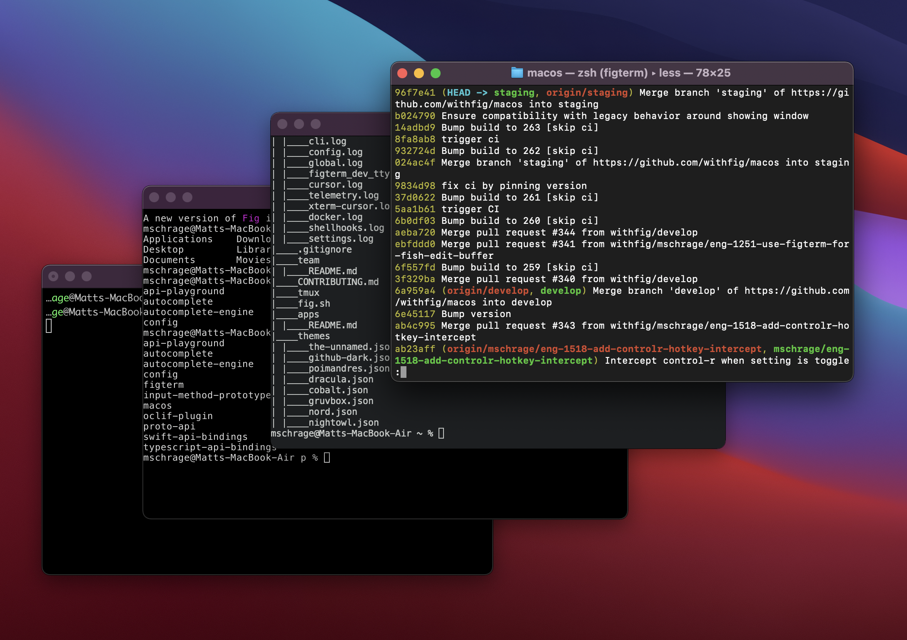

### Window Events & the Accessibility API

Fig relies on quirky macOS APIs to enable seamless integrations with our users' existing terminals. 

Your task is to use the *Accessibility API* to track which <u>window</u> currently has focus and broadcast an event to a separate process whenever the focused window changes. 

#### Overview

1. **Use the Accessibility API** to report metadata about the currently focused window and determine when the focus shifts to either a different window within the same application or a different application entirely

   

   The following information should be tracked for the focused window:

   - Application bundle identifier (`String`)
   - Window Level (`CGWindowLevel` / `NSWindowLevel` / `Int`)
   - Frame (`NSRect`)
   - WindowId (`CGWindowID` or another stable identifier)

   

2. **Design a public API** in Swift for accessing window events and metadata that wraps the accessibility API and makes it more pleasant to work with

   - Implement a mechanism for subscribing for updates to the currently focused window

   - Implement a property that contains a reference to the current window

     

3. **Broadcast window updates** to a separate process

   - Implement some form of IPC in the macOS app

   - Implement a separate executable in either C, C++, Go or Rust.
     - When run, the program should listen for updates from the macOS app and print out the new window metadata whenever the focused window changes

4. **Document your research and design choices** as you go in a README.md file

#### Deliverables

- README.md
- An Xcode project
- Source for the 'listener' executable 

You may use whatever packages and libraries you'd like to achieve the final result.

If you are stuck on something, please reach out! My guess is the first part of the project will be the most challenging.

#### Rubric

We will evalute your project based on:

1. **Correctness**: How well does the implementation work? What edge cases were considered? 
2. **Code quality and design**: Does the public facing API feel like idiomatic Swift? 
3. **Research and documentation**: How well are engineering decisions justified? What options were explored?

---

#### Tips:

This StackOverflow [answer](https://stackoverflow.com/questions/7422666/uniquely-identify-active-window-on-os-x/7423297#7423297) is a great springboard.

> Getting this window reference is tricky, because no strong guarantees exist between the Accessibility API and Quartz Window Services. However, you can work around this in the following ways:
>
> 1. Use `extern "C" AXError _AXUIElementGetWindow(AXUIElementRef, CGWindowID* out);`, as [documented here](https://stackoverflow.com/a/9624565/517815). This isn't *guaranteed* to work, but it works as a ground-floor test to get things started if it works in your version of OSX.
> 2. Get the `CGWindowID` directly, using, for example, `HIWindowGetCGWindowID()`. More details about selecting the active window and extracting the ID can be found in [the reference manual for the Carbon Window Manager](http://developer.apple.com/legacy/mac/library/documentation/Carbon/reference/Window_Manager/Window_Manager.pdf) (warning: large PDF).
> 3. Catalog your `CGWindowID` set using something like [`CGWindowListCreateDescriptionFromArray`](http://developer.apple.com/library/mac/#documentation/Carbon/Reference/CGWindow_Reference/Reference/Functions.html), exactly as Rob suggested. The goal here is then to find some scheme for bridging the Accessibility API and Quartz, but this is conceivable by utilizing, for example, a callback bound to the context of your current active window. I honestly don't know an optimal example of this *that's properly future-proofed*, however.

https://stackoverflow.com/questions/1742890/cgwindowid-from-axuielement

It is possible that you will need to use private APIs, although solutions that only use public APIs are also acceptable. Whichever approach you take, be sure to justify the decision.

- If you decide to use a private API, I would...
  - implement a wrapper around it in Objective-C
  - Import this wrapper into your Swift project using an [Objective-C bridging header](https://developer.apple.com/documentation/swift/imported_c_and_objective-c_apis/importing_objective-c_into_swift) 

